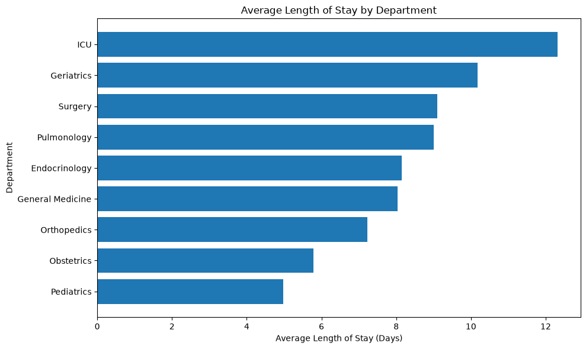
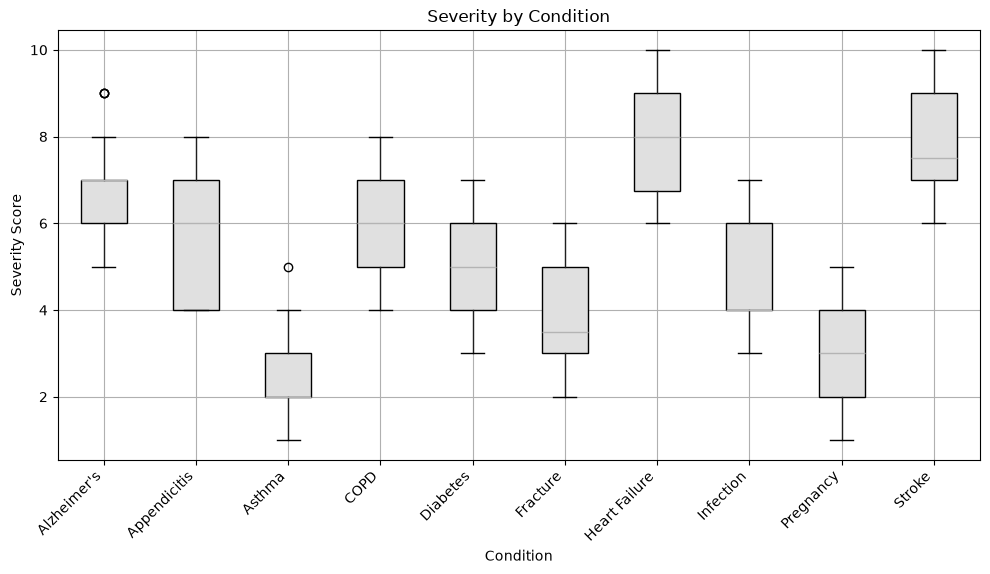
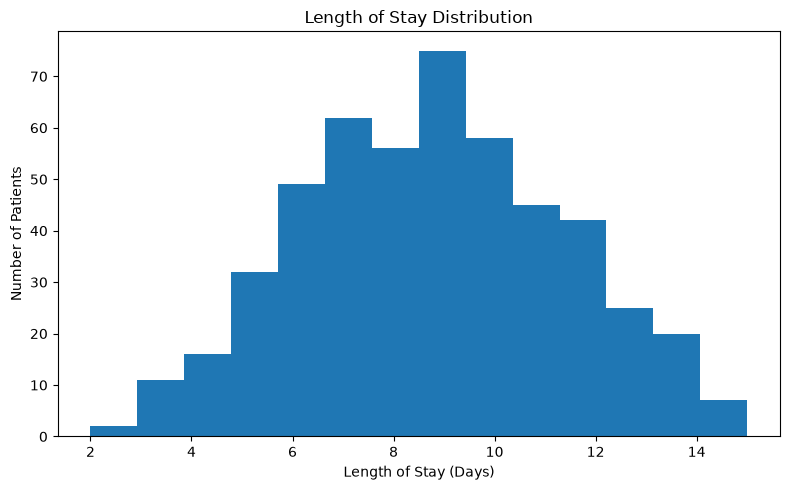
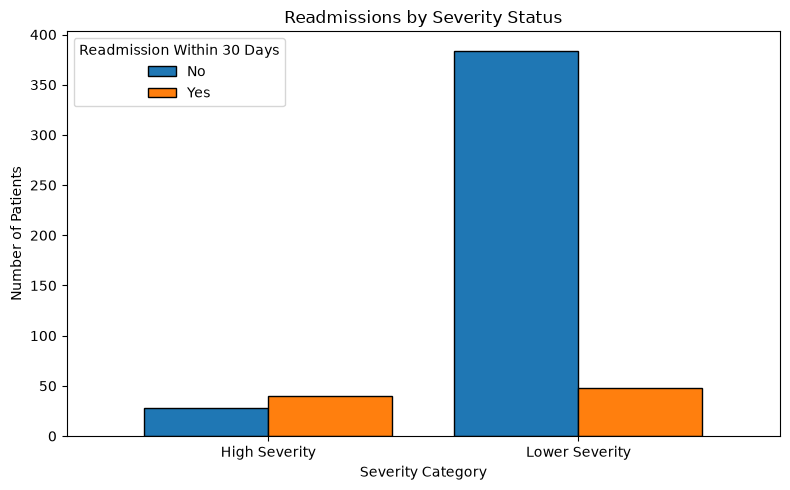
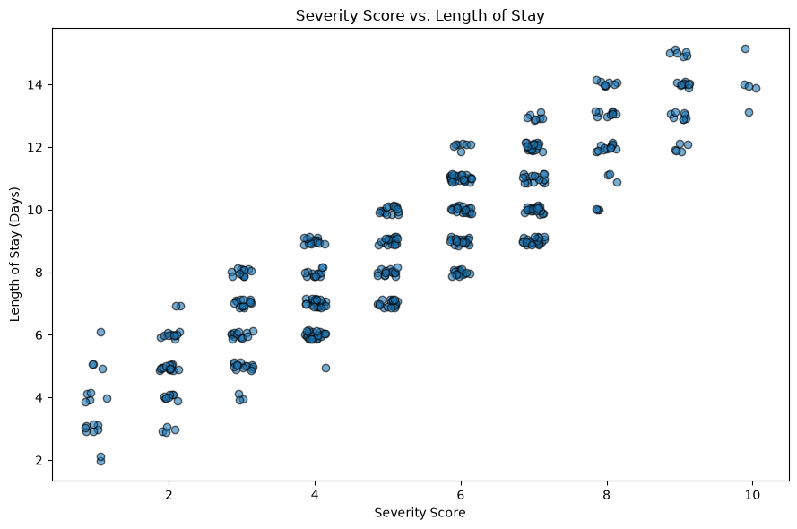

# Healthcare Patient Analytics Using Python

## Project Overview

This project performs an exploratory data analysis (EDA) of synthetic healthcare patient records using Python. The goal is to demonstrate a practical healthcare analytics workflow, including data cleaning, feature engineering, visualization, and business insight generation.

The analysis focuses on patient demographics, clinical conditions, hospital operations, and patient outcomes using pandas, NumPy, and matplotlib. This project complements SQL- and Tableau-based portfolio projects by showcasing end-to-end data analysis in Python.

## Dataset

- Source: Kaggle — [Hospital Patient Dataset](https://www.kaggle.com/datasets/rivalytics/hospital-patient-dataset)
- Provider: Rivalytics
- Records: 500 patients
- Format: CSV
- Domain: Healthcare
- Data Type: Synthetic

The dataset contains synthetic hospital patient records including demographics, admission and discharge dates, medical conditions, departments, severity scores, length of stay, insurance type, discharge status, and 30-day readmission status.

## Project Workflow

```
CSV Dataset
      ↓
Data Quality Checks
      ↓
Data Cleaning
      ↓
Feature Engineering
      ↓
Exploratory Data Analysis
      ↓
Matplotlib Visualizations
      ↓
Business Insights
```

## Skills Demonstrated

- Python
- pandas
- NumPy
- matplotlib
- Data Cleaning
- Data Validation
- Feature Engineering
- Exploratory Data Analysis (EDA)
- Healthcare Analytics
- Data Visualization
- Business Insight Development
- Git
- GitHub Documentation

## Exploratory Analyses

- Patient age and gender distributions
- Age group analysis
- Most common medical conditions
- Severity score comparisons across conditions
- Length of stay analysis
- Monthly admission trends
- Department-level patient volume and average length of stay
- 30-day readmission analysis
- Relationship between severity score and length of stay

## Visualizations

### Average Length of Stay by Department

This visualization compares the average hospital stay across departments to identify differences in patient complexity and resource utilization.



**Key Finding:**  
The ICU recorded the highest average length of stay, followed closely by Geriatrics, while Pediatrics had the shortest average stay.

---

### Severity Score by Condition

This box plot compares the distribution of severity scores across medical conditions.



**Key Finding:**  
Heart Failure and Stroke exhibited the highest severity score distributions, while Asthma and Pregnancy showed comparatively lower severity levels.

---

### Length of Stay Distribution

This histogram illustrates how patient length of stay is distributed across the dataset.



**Key Finding:**  
Most patients remained hospitalized for approximately 7–10 days, with relatively few experiencing very short or extended stays.

---

### Readmissions by Severity Status

This grouped bar chart compares 30-day readmission outcomes between low and high severity patients.



**Key Finding:**  
Although lower-severity patients accounted for more readmissions in total, high-severity patients had a substantially higher proportion of readmissions.

---

### Severity Score vs Length of Stay

This scatter plot examines the relationship between illness severity and hospital length of stay.



**Key Finding:**  
Patients with higher severity scores generally experienced longer hospital stays, indicating a positive relationship between illness severity and resource utilization.

## Key Business Insights

- Patients with higher severity scores generally experienced longer hospital stays.
- The ICU recorded both the highest patient volume and the longest average length of stay.
- Patients aged 61 years and older represented the largest admission group.
- Alzheimer's was the most common condition, while Heart Failure and Stroke were associated with the highest severity scores.
- High-severity patients experienced a proportionally higher rate of 30-day readmissions.
- Monthly admissions remained relatively stable throughout the year with only minor fluctuations.

## Repository Structure

```
healthcare-data-exploration-python/
│
├── data/
│   ├── healthcare_dataset.csv
│   └── data_dictionary.md
│
├── notebooks/
│   └── healthcare_analysis.ipynb
│
├── screenshots/
│   ├── avg_los_department.png
│   ├── condition_severity.png
│   ├── los_distribution.png
│   ├── readmissions_severity.png
│   └── severity_vs_los.png
│
├── README.md
│
├── requirements.txt
│
└── .gitignore
```

## How to Run

1. Clone the repository
2. Install the required dependencies:

```bash
pip install -r requirements.txt
```
3. Open ```notebooks/healthcare_analysis.ipynb```
4. Run the notebook cells sequentially

## Limitations

This analysis uses a synthetic dataset and should not be interpreted as representing real-world patient populations or clinical outcomes. The dataset contains 500 patient records, which limits the generalizability of the findings. The analysis is intended to demonstrate a practical healthcare analytics workflow rather than provide clinical conclusions.

## Future Improvements

- Analyze larger synthetic or de-identified healthcare datasets.
- Expand the analysis with additional healthcare operational KPIs.
- Compare patient outcomes across multiple hospitals or facilities.
- Incorporate additional healthcare quality and utilization measures.